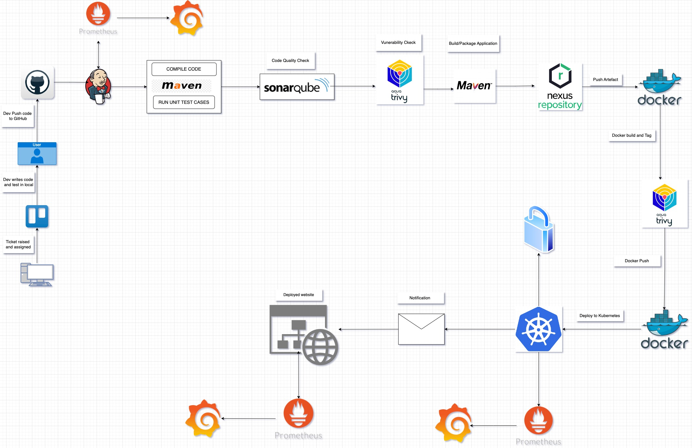

The Ultimate CICD Corporate DevOps Pipeline Project | devopsshack

## Phase-1: Infra Setup
1. Create vm's for Jenkins, Nexus and SonarQube.
2. Setup EKS with new user.

## Phase-2: Source Code Setup
1. Create a secure private git repo.
2. Implement token-based authentication.
3. Successfully push source code into the repo, ensuring version control.

## Phase-3: Configure Jenkins and CICD Pipeline.
1. Create CICD Pipeline.
2. CICD + Mail Notification.

## Phase-4: Monitoring 
1. System-level Monitoring (CPU and RAM) using node-exporter.
2. Website monitoring using blackbox-exporter.
3. Leveraged (Prometheus and Grafana) for effective Visualization and Analysis.

-----------------------

### Key Technologies:
- AWS EC2: Provides scalable compute capacity for pipeline infrastructure.
- Kubernetes (k8s): Orchestrates containerized applications for efficient deployment and scaling.
- SonarQube: Ensures code quality through static code analysis and continuous inspection.
- Nexus: Manages artifacts securely in a centralized repository.
- Jenkins: Automates CI/CD workflows, from building and testing to deployment and monitoring.
- Docker: Containerizes applications to ensure consistency across different environments.
- Trivy: Enhances security by scanning project files and container images for vulnerabilities.
- Prometheus & Grafana: Monitors the health and performance of applications and infrastructure in real-time.
- Helm: For cluster monitoring.

-----------------------

### Workflow Steps:
1. Ticket Raised: Developer raises a ticket for a new feature or bug fix.
2. Code Development: Developer works on code changes locally.
3. Code Pushed to Git: Developer pushes changes to Git repository.
4. Git Checkout: The pipeline checks out the code from the main branch.
5. Compile: The pipeline compiles the code using Maven.
6. Automated Testing: The pipeline runs automated tests to ensure code quality.
7. File System Scan: Trivy scans the file system for vulnerabilities.
8. SonarQube Analysis: The pipeline performs a SonarQube analysis for code quality.
9. Quality Gate: The pipeline waits for the SonarQube quality gate results.
10. Build: The pipeline packages the application.
11. Publish to Nexus: The pipeline publishes the build artifacts to Nexus.
12. Build & Tag Docker Image: The pipeline builds and tags a Docker image.
13. Docker Image Scan: Trivy scans the Docker image for vulnerabilities.
14. Push Docker Image: The pipeline pushes the Docker image to a registry.
15. Deploy to Kubernetes: The pipeline deploys the application to a Kubernetes cluster.
16. Verify the Deployment: The pipeline verifies the deployment by checking the pods and services in Kubernetes.
17. Monitoring and Feedback: Real-time monitoring of key metrics and collection of feedback for improvement.

